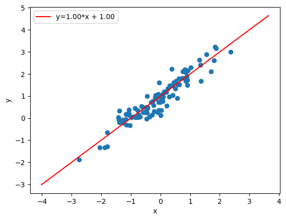

<!--
Document Author
Yuta Nakahara <y.nakahara@waseda.jp>
Shota Saito <shota.s@gunma-u.ac.jp>
-->

---

<div align="center">
<b>Our algorithm for the meta-tree model is accepted at AISTATS 2025! Click <a href="https://bayesml.github.io/BayesML/examples/metatree_prediction_interval.html">here</a>!</b>
</div>

---


# Your First Library for Bayesian Machine Learning

BayesML contributes to wide society thourgh promoting education, research, and application of machine learning based on Bayesian statistics and Bayesian decision theory.

## Characteristics

* **Easy-to-use:**
  * You can use pre-defined Bayesian statistical models by simply importing it. You don't need to define models yourself like PyMC or Stan.
* **Bayesian Decision Theoretic API:**
  * BayesML's API corresponds to the structure of decision-making based on Bayesian decision theory. Bayesian decision theory is a unified framework for handling various decision-making processes, such as parameter estimation and prediction of new data. Therefore, BayesML enables intuitive operations for a wider range of decision-making compared to the fit-predict type API adopted in libraries like scikit-learn. Moreover, many of our models also implement fit-predict functions.
* **Model Visualization Functions:**
  * All packages have methods to visualize the probabilistic data generative model, generated data from that model, and the posterior distribution learned from the data in 2~3 dimensional space. Thus, you can effectively understand the characteristics of probabilistic data generative models and algorithms through the generation of synthetic data and learning from them.
* **Fast Algorithms Using Conjugate Prior Distributions:**
  * Many of our learning algorithms adopt exact calculation methods or variational Bayesian methods that effectively use the conjugacy between probabilistic data generative models and prior distributions. Therefore, they are much faster than general-purpose MCMC methods and are also suitable for online learning. Although some algorithms adopt MCMC methods, but they use MCMC methods specialized for each model, taking advantage of conjugacy.

For more details, see our [website](https://bayesml.github.io/BayesML/).

## News

* Our algorithm for the meta-tree model has been accepted to AISTATS 2025! For more details, please see the links below.
  * [Paper](https://proceedings.mlr.press/v258/nakahara25a.html)
  * [Code Example](https://bayesml.github.io/BayesML/examples/metatree_prediction_interval.html)

## Installation

Please use the following commands to install BayesML.

```bash
pip install bayesml
```

The following are required.

* Python (>= 3.7)
* NumPy (>= 1.20)
* SciPy (>= 1.7)
* MatplotLib (>= 3.5)
* Scikit-learn (>= 1.1)

## Tutorial

Each model in BayesML has two classes. One is `GenModel`, which can be used for parameter generation from prior or posterior distributions, and data generation. The other is `LearnModel`, which can be used for estimating posterior distributions from data and calculating predictive distributions. Each has an API that aligns with Bayesian decision theory. Let's look at how to use each with the `linearregression` model as an example.

### Synthetic Data Generation with `GenModel`

First, let's import the library.

```python
import numpy as np
from bayesml import linearregression
```

Next, we create an instance of the probabilistic data generative model. Here, we specify the dimension of the regression coefficients (including the constant term) as `c_degree=2` as a constant of the model, and we specify the regression coefficients as `theta_vec = np.array([1,1])` and the precision (inverse of variance) of the noise term as `tau = 10` as parameters.

```python
gen_model = linearregression.GenModel(
    c_degree = 2, # degree
    theta_vec = np.array([1,1]), # coefficients
    tau = 10, # noise precision
)
```

You can visualize the characteristics of the created model by the following method.

```python
gen_model.visualize_model()
```

>Output:  
>theta_vec:  
>[1. 1.]  
>tau:  
>10.0  
>

To generate a sample and save it to variables `x` and `y`, we use the following method:

```python
x,y = gen_model.gen_sample(sample_size=100)
```

Let's also generate test data for later use.

```python
x_test,y_test = gen_model.gen_sample(sample_size=100)
```

### Learning and Decision Making with `LearnModel`

Let's use `LearnModel` to learn a model from the data we just generated.

Of course, the data that can be used with `LearnModel` is not limited to data generated from `GenModel`. You can analyze various real-world data.

First, let's create an instance of the learning model. Here, we only specify the degree `c_degree = 2` as a constant of the model, but you can also specify hyperparameters for the prior distribution.

```python
learn_model = linearregression.LearnModel(
    c_degree = 2, # degree
)
```

A method for visualizing the posterior distribution of parameters is implemented in `LearnModel`. If you visualize the posterior distribution at this point, the prior distribution will be displayed since learning from data has not yet been performed.

```python
learn_model.visualize_posterior()
```

>Output:  
>

To update the posterior distribution through learning from data, we use the following method.

```python
learn_model.update_posterior(x,y)
```

If you visualize the updated posterior distribution, you can see that the density of the posterior distribution has moved closer to the true parameters used to generate `x` and `y`.

```python
learn_model.visualize_posterior()
```

>Output:  
>

To make decisions such as parameter estimation and prediction of new data based on the learned model, we proceed as follows.

For parameter estimation, we use the `estimate_params` method. By specifying the `loss` option as `squared`, you can obtain an estimate that minimizes the Bayes risk function based on the squared error loss function. The resulting value is the expected value of the posterior distribution.

```python
learn_model.estimate_params(loss="squared",dict_out=True)
```

>Output:  
>{'theta_vec': array([0.99846525, 0.96263024]), 'tau': 6.9036925167513195}

If you specify the `loss` option as `abs`, you can obtain an estimate that minimizes the Bayes risk function based on the absolute error loss function. The resulting value is the median of the posterior distribution, which is why the estimated value of `tau` differs from the previous one.

```python
learn_model.estimate_params(loss="abs",dict_out=True)
```

>Output:  
>{'theta_vec': array([0.99846525, 0.96263024]), 'tau': 6.858623148933392}

To predict new data, we first use the following method to calculate the predictive distribution for new explanatory variables.

```python
learn_model.calc_pred_dist(x_test)
```

Next, we use the `make_prediction` method to obtain predicted values. Similar to parameter estimation, you can specify the loss function using the `loss` option. (In this example, the same predicted values will be returned whether you assume squared error loss or absolute error loss since the posterior predictive distribution is symmetrical.)

```python
y_pred = learn_model.make_prediction(loss="squared")
```

Let's calculate the mean squared error.

```python
mse = np.sum((y_test - y_pred)**2) / len(y_test)
print(f"MSE: {mse}")
```

>Output:  
>MSE: 0.09020880284291456

Taking into account that the precision (inverse of variance) of the noise term used for data generation was 10, we can see that the predictions are achieved with sufficient accuracy.

### Sampling from Posterior Distribution Using `GenModel`

`GenModel` can also be used to sample parameters from the posterior distribution learned by `LearnModel`, or to sample new data from the posterior predictive distribution.

First, the hyperparameters of the posterior distribution learned by `LearnModel` can be obtained as follows.

```python
hn_params = learn_model.get_hn_params()
print(hn_params)
```

>Output:  
>{'hn_mu_vec': array([0.99846525, 0.96263024]), 'hn_lambda_mat': array(\[[ 99.87503339,   5.96145913],[  5.96145913, 101.        ]]), 'hn_alpha': 51.0, 'hn_beta': 7.387351026461872}

By passing these to `GenModel`, you can sample parameters from the posterior distribution.

We create a new `GenModel` instance for parameter sampling and pass the hyperparameters through the `set_h_params` method. (In the example below, we are unpacking the values of the dictionary `hn_params` using `*` for `hn_params.values()`. This is a Python feature, not a BayesML functionality.)

```python
posterior_gen_model = linearregression.GenModel(
    c_degree = 2, # degree
)
posterior_gen_model.set_h_params(*hn_params.values())
```

We use the `gen_params` method to generate parameters and the `get_params` method to retrieve the generated parameters. If you want to perform multiple samplings, please repeat the following in a `for` loop.

```python
posterior_gen_model.gen_params()
print(posterior_gen_model.get_params())
```

>Output:  
>{'theta_vec': array([1.00935782, 0.93804208]), 'tau': 5.50775630793475}

To sample new data from the posterior predictive distribution, we generate data after sampling parameters. When we generated the synthetic data, we did not provide explanatory variables as arguments to `gen_sample` (see [here](#synthetic-data-generation-with-genmodel)), but you can also specify them explicitly as follows.

```python
posterior_gen_model.gen_params()
_,y_new = posterior_gen_model.gen_sample(x=x_test[:10])
print(f"y_new: {y_new}")
```

>Output:  
>y_new: [-0.49532975  2.03473075  1.13758759 -0.46735058 -0.71902336 -0.09288005 0.89463227  2.07886012  2.81211771  1.60020635]

## Package list

The following packages are currently available. In this library, a probabilistic data generative model, prior distribution, posterior distribution (or approximate posterior distribution), and predictive distribution (or approximate predictive distribution) are collectively called a model.

* [Bernoulli model](https://bayesml.github.io/BayesML/bayesml.bernoulli.html "Bayesml Bernoulli Model")
* [Categorical model](https://bayesml.github.io/BayesML/bayesml.categorical.html "BayesML Categorical Model")
* [Poisson model](https://bayesml.github.io/BayesML/bayesml.poisson.html "BayesML Poisson Model")
* [Normal model](https://bayesml.github.io/BayesML/bayesml.normal.html "BayesML Normal Model")
* [Multivariate normal model](https://bayesml.github.io/BayesML/bayesml.multivariate_normal.html "BayesML Multivariate Normal Model")
* [Exponential model](https://bayesml.github.io/BayesML/bayesml.exponential.html "BayesML Exponential Model")
* [Gaussian mixture model](https://bayesml.github.io/BayesML/bayesml.gaussianmixture.html "BayesML Gaussian Mixture Model")
* [Linear regression model](https://bayesml.github.io/BayesML/bayesml.linearregression.html "BayesML Lenear Regression Model")
* [Meta-tree model](https://bayesml.github.io/BayesML/bayesml.metatree.html "BayesML Meta-tree Model")
* [Autoregressive model](https://bayesml.github.io/BayesML/bayesml.autoregressive.html "BayesML Autoregressive Model")
* [Hidden Markov normal model](https://bayesml.github.io/BayesML/bayesml.hiddenmarkovnormal.html "BayesML Hidden Markov Normal Model")
* [Context tree model](https://bayesml.github.io/BayesML/bayesml.contexttree.html "BayesML Context Tree Model")

In the future, we will add packages to deal with more complicated hierarchical models.

## How to contribute

Thank you for considering a contribution to BayesML. For more information, please see [here](./CONTRIBUTING.md).

## Citation

When you use BayesML for your academic work, please provide the following bibliographic reference.

Plain text

```text
Y. Nakahara, N. Ichijo, K. Shimada, Y. Iikubo, 
S. Saito, K. Kazama, T. Matsushima, BayesML Developers, ``BayesML,'' 
Python package version 0.3.1, 
[Online] https://github.com/bayesml/BayesML
```

BibTeX

```bibtex
@misc{bayesml,
  author = {Nakahara, Yuta and Ichijo, Naoki and Shimada, Koshi and
            Iikubo, Yuji and Saito, Shota and Kazama, Koki and
            Matsushima, Toshiyasu and {BayesML Developers}},
  title = {{BayesML}},
  howpublished = {Python package version 0.3.1},
  note = {\url{https://github.com/bayesml/BayesML}},
  year = {2025}
}
```
